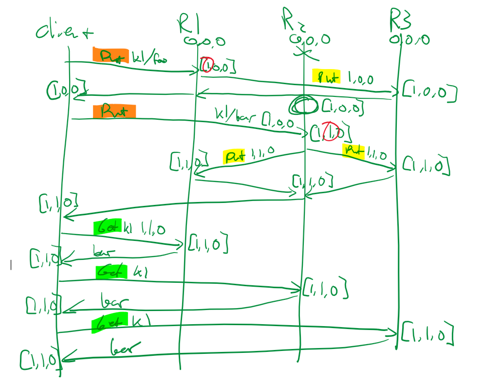
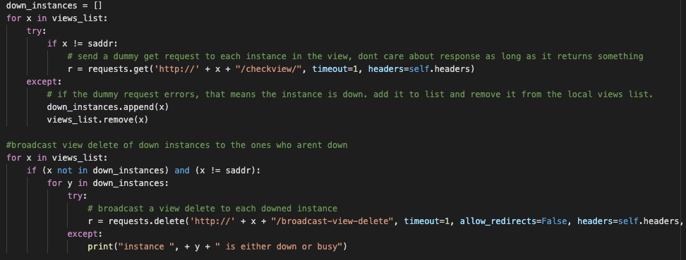
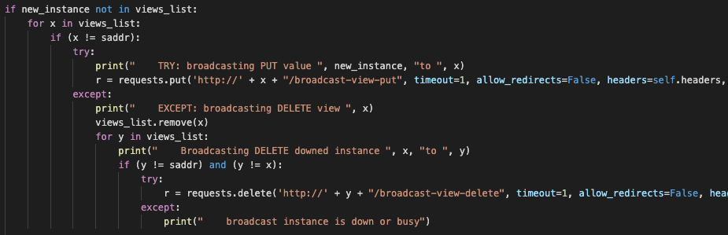

# Mechanism Description
the description of the mechanisms implemented for causal dependency tracking and detecting that a replica is down

* `Assignment 3`
* `Garrett Webb` : cruzid: `gswebb`
* `Kai Hsieh` : cruzid: `kahsieh`
* `Rahul Arora` : cruzid: `raarora`

## Sharding Mechanism
* We attempt to divide views evenly into shards. If there is an odd number of shards, we will add an extra view to the
last shard.
* In order to do this, we first check the number of noodes in the view divided by the specified shard count. if there are enough nodes to split into shards such that there are at least 2 nodes in each shard, then we proceed to split them up. 
* we split them up by iterating through the list of nodes in the view `n` times where `n` is the number of nodes in the view. every `floor(shardcount / 2)` iterations, we increment the shardID that we are assigning the views to and zero out our number of nodes in the shard so far. Because we use the `floor` division, this will always divide evenly an even number of nodes, and if there is an odd number, the last node will get added to the last shard, as an extra.
* if the shard count was not specified, then we simply dont worry about the shard hashmap until later, when the PUT request endpoint for `/add-member` is called. it is at this time when the node gets the updated shard hashmap, keyvaluestore, and vectorclock from the other members of the same shard.
* if the command to start the server specifies a number of shards that is incompatible with the number of elements in the view, i.e. there is not at least 2 nodes per 1 shard, the program will display an error to the user and exit without booting the server. This same logic will result in a 404 error if sent to the `/reshard` endpoint
* We store lists of shards in a python dictionary, using a "shard ID" as a key, and a list of corresponding views as the value. We have a local variable in each server instance to record which shard each view is a part of
* Shard IDs are integers, starting from 1 and going to the number of shards (inclusive)

## Sharding Mechanism
* 

# BELOW THIS IS FROM ASSIGNMENT 3
## Causal Consistency Mechanism
* We made the graph below as a guide for how to implement the causal consistency portion of this project.
* 
* We pass vector clocks between the client and replicas. Vector clocks are stored as python dictionaries (hash tables)
with the keys being the replica server addresses, and the values being the corresponding vector clock values for each 
replica. Since vector clocks are passed back from replicas to clients, who then send them back to other replicas in new 
requests, if a replica determines that their vector clock is not updated, which is likely because the replica instance
was disconnected from the others, it will GET request all other replicas for their updated key-value store values and updated
vector clock(s). Additionally, vector clock values are only incremented by the replicas (by 1) when a replica receives a 
PUT or DELETE request from a client. At this point, the replica will broadcast the request to other replicas with the 
updated vector clock as casual metadata, causing them to update their vector clocks to match the one sent in the broadcast.

## View Operations Mechanism
* Using the logic below, we were able to get a list of downed instances upon a view-get and broadcast the view-delete operation for all downed instances to all instances that are still up.
*  
* On view get, we send a dummy get request to each view that we have a record of being running. If we do not receive a response before the request times out, we can safely assume that the replica is down. 
* The logic to detect and broadcast view-delete from within other server functionality is also largely reused and looks like this. in this example from the PUT functionality, the server will broadcast to the terminal key put endpoint, which will not further forward the request. If one of those broadcasts fails, that means the server being broadcasted to is down and we will then broadcast a view delete to all other replicas in the view list.
* 
* The thought process behind this was that if on any broadcasted request, there is no response from the broadcastee, that means that the instance is either down or disconnected and must be removed from the views list, which is shared by all the instances. This is why the view-delete operation is then broadcasted.
* One false positive that could happen in this model is the case of one of the broadcastee instances being slow to respond. This could happen for many reasons, including the case that the instance is broadcasting and waiting for responses itself. In this case, the instance would not be able to respond before the timeout of 1 second that we specified. The timeout is low because with all of these instances being run on the same system through docker, a successful connection should never take that long.
* One false negative that could happen in this model is the case of one of the broadcastee instances responds and then fails post-request. The request to check if the replica was alive would have succeeded, but the replica would have died immediately after.

The mechanism-description.md file contains a thorough and clear description of the causal dependency tracking mechanism. The description explains how the mechanism was implemented, what data structures and algorithms were used, and the rationale for any design decisions. In particular, the description covers how the KVS handles scenarios in which a replica receives a request with causal metadata indicating that the request shouldn't be served immediately.

The mechanism-description.md file contains a thorough and clear description of the replica failure detection mechanism. The description explains how the mechanism was implemented, what data structures and algorithms were used, and the rationale for any design decisions. In particular, the description covers what circumstances, if any, could lead to a false positive (a replica is deemed to be down when it is up) or a false negative (a replica is deemed to be up when it is down).